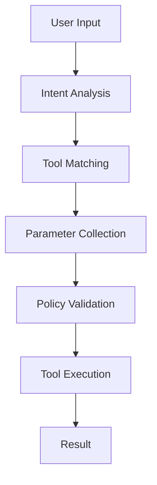

# @lit-protocol/full-self-signing

The core agent implementation for the Lit AI Agent framework. This package provides the main functionality for processing natural language instructions and executing blockchain operations through registered tools.

## Features

- Natural language processing using OpenAI's GPT models
- Intent matching with available tools
- Secure transaction execution through Lit Protocol
- Policy enforcement and permission management
- Extensible tool system
- Multi-chain support
- Configurable security policies
- Detailed execution logging

## Installation

```bash
pnpm add @lit-protocol/full-self-signing
```

## Basic Usage

```typescript
import { LitAgent } from '@lit-protocol/full-self-signing';

// Initialize the agent
const agent = new LitAgent({
  litAuthPrivateKey: 'your-lit-auth-private-key',
  openAiApiKey: 'your-openai-api-key',
  openAiModel: 'gpt-4o-mini' // optional, defaults to gpt-4o-mini
});

await agent.init();

// Process user intent and execute matching tool
const result = await agent.executeTool(
  'ipfs://tool-cid',
  {
    // Initial parameters
  }
);
```

## Advanced Usage

### Custom Callbacks

```typescript
const result = await agent.executeTool(
  'ipfs://tool-cid',
  {
    // Initial parameters
  },
  {
    // Permission callback for tool approval
    permissionCallback: async (tool) => {
      // Custom permission logic
      return true;
    },
    
    // Parameter callback for missing parameters
    parameterCallback: async (tool, missingParams) => {
      // Custom parameter collection logic
      return {
        param1: 'value1',
        param2: 'value2'
      };
    },
    
    // Policy callback for custom policy configuration
    policyCallback: async (tool, currentPolicy) => ({
      usePolicy: true,
      policyValues: {
        // Custom policy configuration
      }
    })
  }
);
```

### Error Handling

```typescript
try {
  const result = await agent.executeTool('ipfs://tool-cid', params);
} catch (error) {
  if (error instanceof LitAgentError) {
    // Handle agent-specific errors
    console.error('Agent error:', error.message);
  } else if (error instanceof PolicyViolationError) {
    // Handle policy violations
    console.error('Policy violation:', error.message);
  } else {
    // Handle other errors
    console.error('Unexpected error:', error);
  }
}
```

## Architecture

The agent works by:
1. Analyzing user intent through OpenAI
2. Matching intent to available tools
3. Collecting necessary parameters
4. Validating against policies
5. Executing the tool through Lit Protocol

### Tool Execution Flow



## Security

The agent includes several security features:
- Tool-specific policy enforcement
- Permission callbacks for user approval
- Secure key management through Lit Protocol
- Parameter validation and sanitization
- Rate limiting and execution quotas
- Audit logging

## API Reference

### `LitAgent`

Main class for interacting with the agent system.

#### Constructor
```typescript
constructor(config: {
  litAuthPrivateKey: string;
  openAiApiKey: string;
  openAiModel?: string;
  options?: AgentOptions;
})
```

#### Methods

##### `init()`
Initialize the agent and set up the signer.
```typescript
async init(): Promise<void>
```

##### `executeTool()`
Execute a specific tool with parameters and callbacks.
```typescript
async executeTool(
  toolCid: string,
  params: Record<string, any>,
  callbacks?: ExecutionCallbacks
): Promise<ExecutionResult>
```

##### `analyzeUserIntentAndMatchAction()`
Process natural language input and find matching tool.
```typescript
async analyzeUserIntentAndMatchAction(
  input: string
): Promise<ToolMatch[]>
```

## Contributing

Please see our [Contributing Guide](../../CONTRIBUTING.md) for details on how to contribute to this package.

## License

MIT
